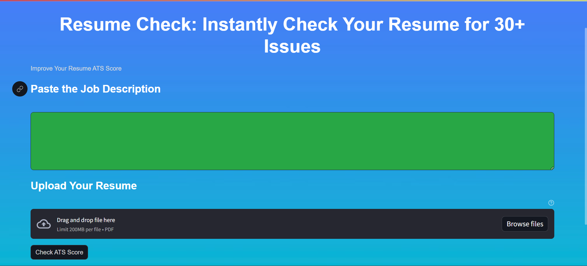
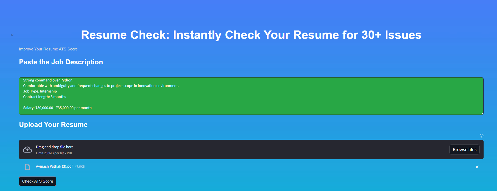
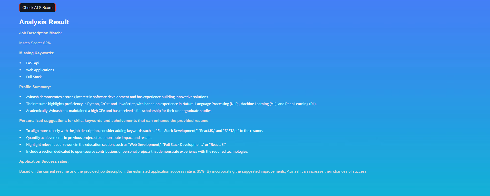

# Resume Cabin: AI-Powered Resume ATS Checker

## About The Project






Resume Cabin is an advanced Applicant Tracking System (ATS) designed to revolutionize the resume evaluation process using cutting-edge Generative AI models from Google. This tool empowers users to submit their resumes for comprehensive analysis based on a provided job description. With expertise in various tech domains such as software engineering, data science, and cloud engineering, Resume Cabin evaluates resumes in the competitive job market. Users can upload resumes in PDF format, and the system extracts relevant information using PyPDF2. The analysis includes a percentage match with the job description, identification of missing keywords, and a refined profile summary. This innovative solution aims to help individuals enhance their resumes for better performance in job applications. The Streamlit web application provides an intuitive interface, making the resume enhancement process efficient and accessible.

## Built With

- Streamlit
- PyPDF2
- Google Generative AI
- Python-dotenv

## Getting Started

This section provides instructions on setting up your project locally. Follow these steps to get a local copy up and running:

### Installation Steps

**Option 1: Installation from GitHub**

1. **Clone the Repository**

   Open your terminal or command prompt.
   Navigate to the directory where you want to install the project.
   Run the following command to clone the GitHub repository:
   ```bash
   git clone https://github.com/KalyanMurapaka45/Resume-Cabin.git
2. **Install Dependencies**
   Run the following command to install project dependencies:
   ```bash
   streamlit run app.py
3. **API Key Setup**
   To use this project, you need an API key from Google Gemini Large Language Model. Follow these steps to obtain and set up your API key:
   1. **Get API Key:**
      Visit the provided link and follow the instructions to create an account and obtain your API key.
   2. **Set Up API Key:**
      Create a file named .env in the project root.
      Add your API key to the .env file:
      ```bash
      GOOGLE_API_KEY=your_api_key_here
    Note: Keep your API key confidential. Do not share it publicly or expose it in your code.
4. **License**
   This project is licensed under the Open Source Initiative (OSI) approved GNU General Public License v3.0 License. See the LICENSE.txt file for details.
5. **Acknowledgements**
   We'd like to extend our gratitude to all individuals and organizations who have played a role in the development and success of this project. Your support, whether through contributions, inspiration, or encouragement, has been invaluable. Thank you for being a part of our journey.
   sql
   ```bash
   Copy and paste this Markdown content into a file named `readme.md` in your project repository. This format provides a structured and informative overview of your project, including installation instructions, API setup, contributing guidelines, and acknowledgements. Adjust any URLs or specific details as per your project's actual setup and requirements.
